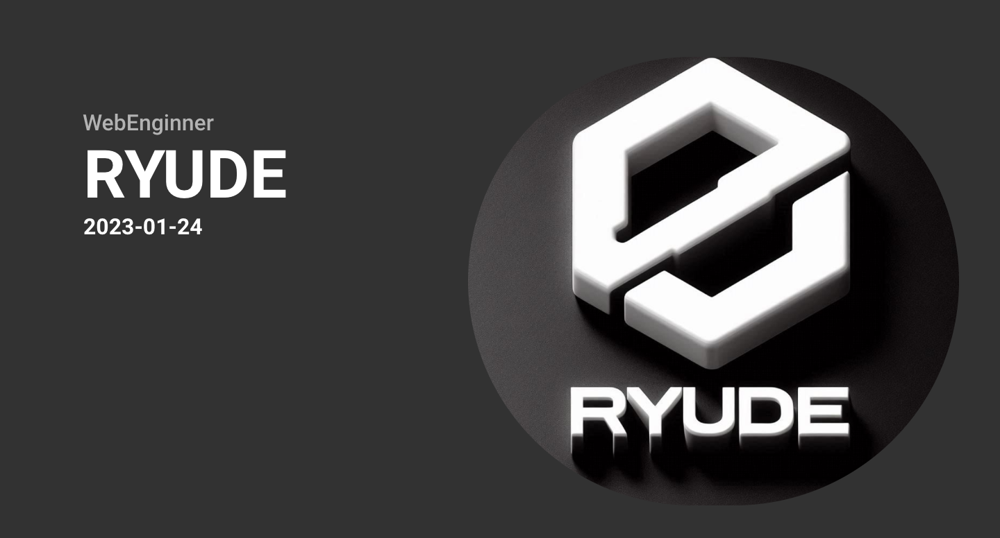

    
    
    
    
    
    
    

<h2 align="center">My Skills</h2>

<h4>フロントエンド</h4>

<h4>バックエンド</h4>

<h4>デプロイ・インフラ</h4>

<h4>ツール・その他</h4>

<h4>プログラミング言語</h4>

<h4>ライブラリ・フレームワーク</h4>

<h3 align="center"></img></h3>

